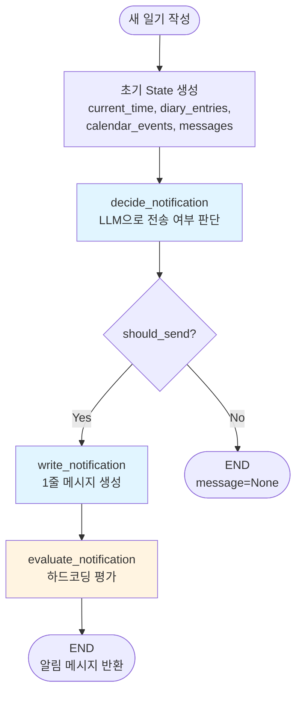
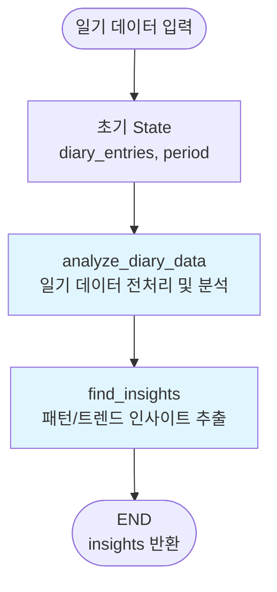
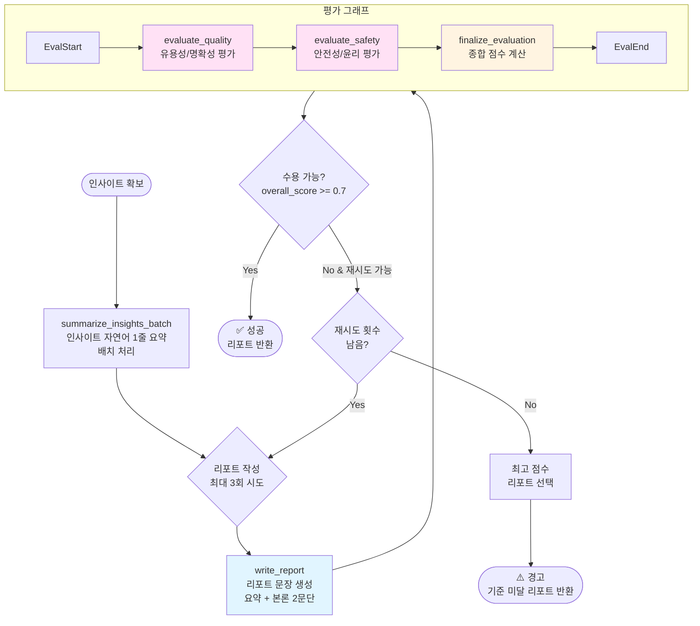
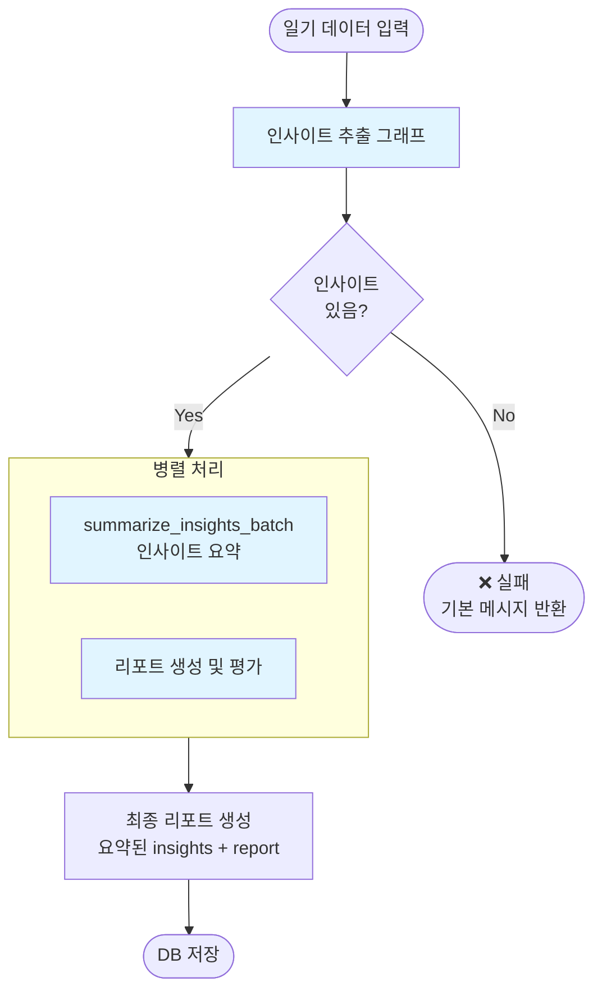
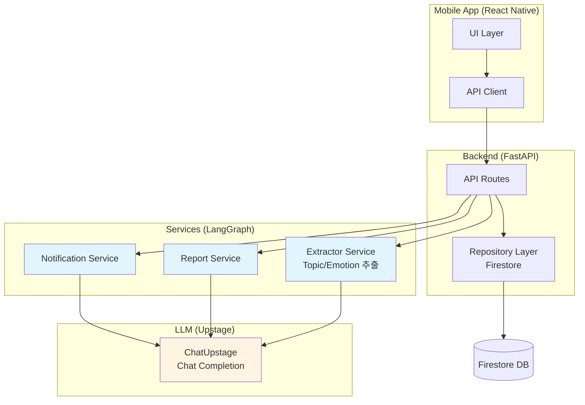

# LangGraph 아키텍처 다이어그램

## 1. Notification Service



**상세 흐름:**
- `decide_notification`: 일기/캘린더 이벤트를 종합하여 LLM이 알림 전송 여부 판단
- `write_notification`: 전송이 결정되면 친근한 1줄 질문 메시지 생성
- `evaluate_notification`: 메시지 품질 평가 (하드코딩, 그래프 외부)

---

## 2. Report Service

### 2.1 인사이트 추출 그래프



### 2.2 리포트 생성 및 평가 그래프



### 2.3 전체 리포트 생성 플로우



---

## 3. 전체 시스템 아키텍처



---

## 4. 주요 State 구조

### NotificationDecisionState
```typescript
{
  current_time: str
  calendar_events: List[Dict]
  diary_entries: List[Dict]
  messages: List[Dict]
  new_diary_entry: Dict
  should_send: Optional[bool]
  send_time: Optional[str]
  message: Optional[str]
  reason: Optional[str]
  evaluation_score: Optional[float]
}
```

### ReportGenerationState
```typescript
{
  diary_entries: List[Dict]
  period_start: str
  period_end: str
  insights: Optional[List[Dict]]
  report: Optional[str]
  summary: Optional[str]
}
```

### ReportEvaluationState
```typescript
{
  report: str
  diary_entries: List[Dict]
  period_start: str
  period_end: str
  quality_score: Optional[float]
  quality_feedback: Optional[str]
  quality_issues: Optional[List[str]]
  safety_score: Optional[float]
  safety_feedback: Optional[str]
  safety_issues: Optional[List[str]]
  overall_score: Optional[float]
  is_acceptable: Optional[bool]
  needs_revision: Optional[bool]
}
```
