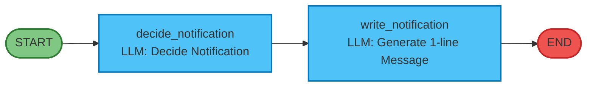
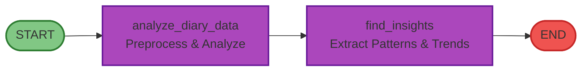
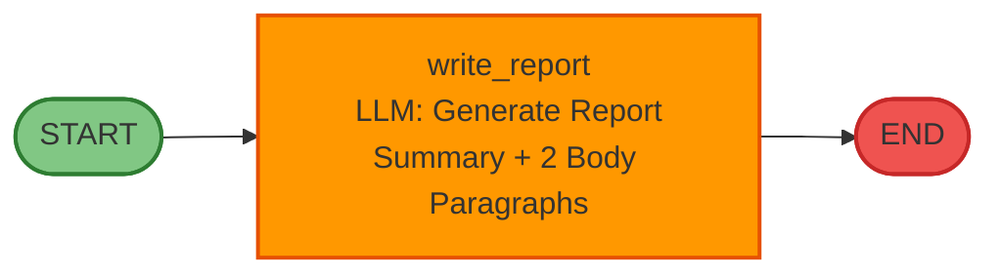
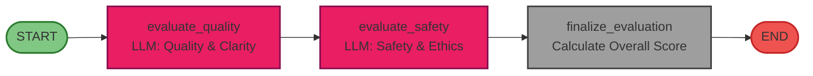
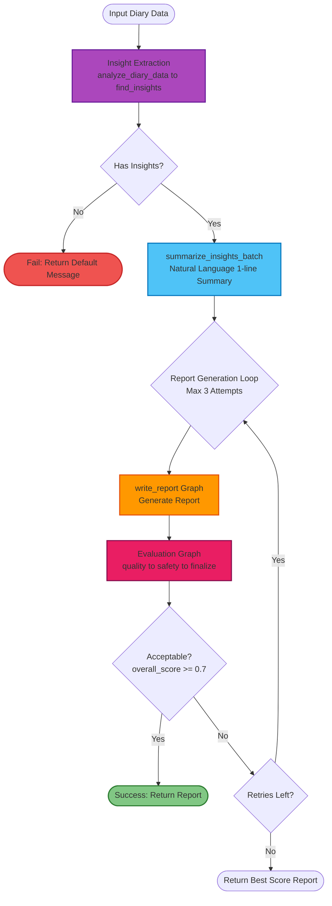

# LangGraph Agent Graphs (Mermaid Live Ready)

## 1. Notification Service Graph

**아래 코드 블록 전체를 복사하세요 (```mermaid부터 ```까지):**



**또는 코드 블록만 복사 (위의 ```mermaid와 ``` 제외하고 안쪽만):**

<details>
<summary>코드만 보기 (클릭하여 펼치기)</summary>

```
graph LR
    Start([START]) --> Decide[decide_notification<br/>LLM: Decide Notification]
    Decide --> Write[write_notification<br/>LLM: Generate 1-line Message]
    Write --> End([END])
    
    style Decide fill:#4FC3F7,stroke:#0277BD,stroke-width:2px
    style Write fill:#4FC3F7,stroke:#0277BD,stroke-width:2px
    style Start fill:#81C784,stroke:#2E7D32,stroke-width:2px
    style End fill:#EF5350,stroke:#C62828,stroke-width:2px
```

</details>

**노드 설명:**
- `decide_notification`: 일기/캘린더 이벤트를 종합하여 LLM이 알림 전송 여부 판단 (should_send, send_time, reason 설정)
- `write_notification`: 전송 결정 시 친근한 1줄 질문 메시지 생성 (message 설정)

**State:** `NotificationDecisionState`

---

## 2. Report Service - Insight Extraction Graph



**코드만 복사:**

<details>
<summary>코드만 보기</summary>

```
graph LR
    Start([START]) --> Analyze[analyze_diary_data<br/>Preprocess & Analyze]
    Analyze --> FindInsights[find_insights<br/>Extract Patterns & Trends]
    FindInsights --> End([END])
    
    style Analyze fill:#AB47BC,stroke:#6A1B9A,stroke-width:2px
    style FindInsights fill:#AB47BC,stroke:#6A1B9A,stroke-width:2px
    style Start fill:#81C784,stroke:#2E7D32,stroke-width:2px
    style End fill:#EF5350,stroke:#C62828,stroke-width:2px
```

</details>

**노드 설명:**
- `analyze_diary_data`: 일기 데이터 전처리 및 기본 분석 수행
- `find_insights`: 감정 변화, 패턴, 트렌드 등 인사이트 추출 (insights 설정)

**State:** `ReportGenerationState`

---

## 3. Report Service - Write Graph



**노드 설명:**
- `write_report`: 인사이트를 바탕으로 리포트 문장 생성 (report, summary 설정)

**State:** `ReportGenerationState`

---

## 4. Report Evaluation Graph



**노드 설명:**
- `evaluate_quality`: 리포트의 유용성과 명확성 평가 (quality_score, quality_feedback, quality_issues)
- `evaluate_safety`: 리포트의 안전성과 윤리적 적절성 평가 (safety_score, safety_feedback, safety_issues)
- `finalize_evaluation`: 종합 점수 계산 및 수용 여부 결정 (overall_score, is_acceptable, needs_revision)

**State:** `ReportEvaluationState`

---

## 5. Complete Report Generation Flow (High-level)



---

## 6. All Graphs Combined View

```mermaid
graph TB
    subgraph Notification["Notification Service"]
        N1([START]) --> N2[decide_notification]
        N2 --> N3[write_notification]
        N3 --> N4([END])
    end
    
    subgraph ReportInsight["Report: Insight Extraction"]
        R1([START]) --> R2[analyze_diary_data]
        R2 --> R3[find_insights]
        R3 --> R4([END])
    end
    
    subgraph ReportWrite["Report: Write"]
        W1([START]) --> W2[write_report]
        W2 --> W3([END])
    end
    
    subgraph ReportEval["Report: Evaluation"]
        E1([START]) --> E2[evaluate_quality]
        E2 --> E3[evaluate_safety]
        E3 --> E4[finalize_evaluation]
        E4 --> E5([END])
    end
    
    style N2 fill:#4FC3F7,stroke:#0277BD,stroke-width:2px
    style N3 fill:#4FC3F7,stroke:#0277BD,stroke-width:2px
    style R2 fill:#AB47BC,stroke:#6A1B9A,stroke-width:2px
    style R3 fill:#AB47BC,stroke:#6A1B9A,stroke-width:2px
    style W2 fill:#FF9800,stroke:#E65100,stroke-width:2px
    style E2 fill:#E91E63,stroke:#880E4F,stroke-width:2px
    style E3 fill:#E91E63,stroke:#880E4F,stroke-width:2px
    style E4 fill:#9E9E9E,stroke:#424242,stroke-width:2px
```



---

## 사용법

1. **Mermaid Live Editor 열기**: https://mermaid.live/
2. **방법 1**: 코드 블록 전체 복사 (```mermaid부터 ```까지)
   - Mermaid Live Editor에 붙여넣으면 자동으로 인식됩니다
3. **방법 2**: 코드만 복사 (```mermaid와 ``` 제외하고 안쪽만)
   - Mermaid Live Editor에 붙여넣어도 작동합니다

**중요:** 
- ❌ ` ```mermaid `만 복사하면 에러가 발생합니다
- ✅ 코드 블록 전체를 복사하거나, 안쪽 코드만 복사해야 합니다
- 각 다이어그램은 독립적으로 복사하여 사용하세요

**색상 설명:**
- 🟢 초록색: START 노드
- 🔴 빨간색: END 노드
- 🔵 파란색: Notification Service 노드
- 🟣 보라색: Insight Extraction 노드
- 🟠 주황색: Report Write 노드
- 🩷 분홍색: Evaluation 노드
- ⚫ 회색: Finalize 노드
